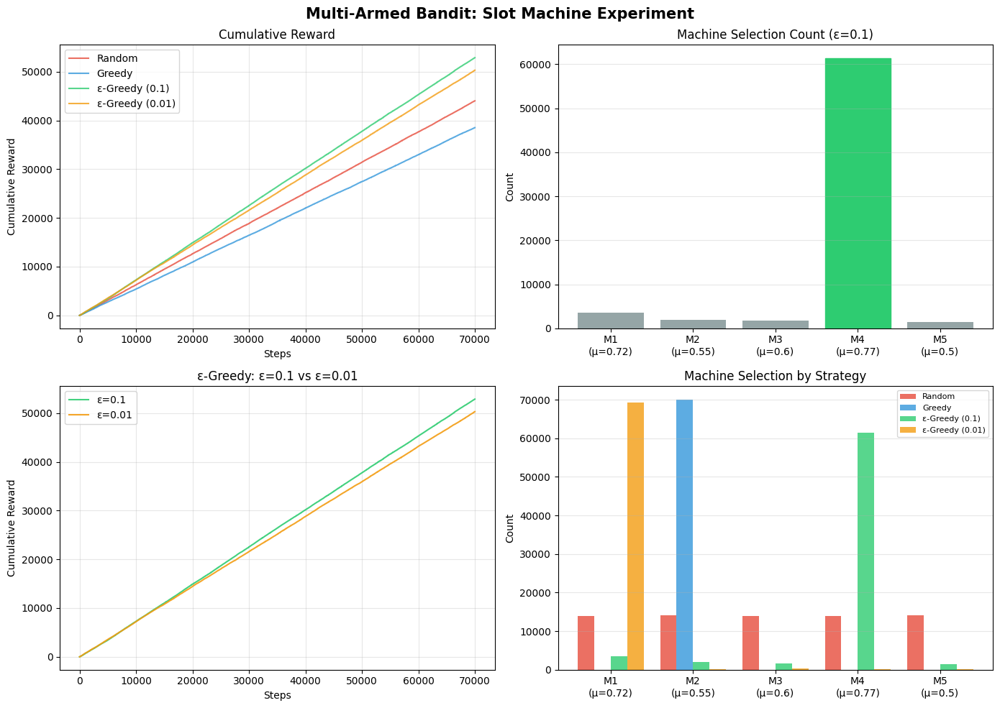

# 🤖 강화학습: 탐색(Exploration)과 이용(Exploitation)의 이해

강화학습(Reinforcement Learning)에서 에이전트가 최적의 정책을 학습하기 위해 직면하는 핵심 과제인 **Exploration-Exploitation Trade-off**에 대한 정리 및 실험 결과 보고서입니다.

---

## 📊 MAB(Multi-Armed Bandit) 실험 결과 분석

두 가지 서로 다른 보상 환경(베르누이 분포, 정규분포)에서 **Random, Greedy, $\epsilon$-Greedy** 전략의 성능을 비교 분석했습니다.

### 1. 누적 보상 곡선 (Cumulative Reward Curve)
실험 결과, 모든 환경에서 **$\epsilon$-Greedy 전략이 가장 높은 누적 보상**을 기록했습니다.

* **베르누이 환경 (10,000 시도):** $\epsilon$-Greedy($\epsilon=0.1$)가 약 **3,841**의 보상을 얻어, Greedy(**3,001**) 및 Random(**2,808**)보다 압도적인 성능을 보였습니다.

* **정규분포 환경 (70,000 시도):** 보상의 편차가 큰 정규분포 환경에서는 **Greedy 전략(38,520.61)이 Random(44,020.34)보다 낮은 성적**을 기록하는 기현상이 발생했습니다. 이는 Greedy 전략이 초반 노이즈로 인해 잘못된 선택지에 고착되었기 때문입니다.

### 2. 머신별 선택 비율 (Selection Counts)
에이전트가 최적의 머신을 얼마나 잘 찾아냈는지 선택 횟수를 통해 확인했습니다.

* **탐색의 성공:** 베르누이 실험에서 $\epsilon$-Greedy는 실제 성공 확률이 가장 높은 **M2(p=0.4)를 8,548회 선택**하며 집중적으로 공략했습니다.
* **지역 최적점의 함정:** 반면 Greedy 전략은 초반 20회 탐색에서 운 좋게 수익이 높았던 **M1(p=0.3)에 고착되어 무려 9,886회나 잘못된 선택**을 반복했습니다. 정규분포 실험에서도 최적 머신인 M4($\mu=0.77$) 대신 다른 머신에 머무르며 성능이 저하되었습니다.

### 3. $\epsilon$값 변화 실험 (0.1 vs 0.01)
학습의 강도($\epsilon$)에 따른 장기적인 성과 차이를 분석했습니다.

* **$\epsilon=0.1$ (높은 탐색):** 정답을 찾는 속도는 빠르지만, 정답을 찾은 후에도 10%의 확률로 계속 다른 머신을 탐색하느라 보상 손실이 발생합니다.
* **$\epsilon=0.01$ (낮은 탐색):** 정답 수렴 속도는 느리지만, 장기전(100,000회 시도)에서는 정답에 더 집중할 수 있어 **최종 누적 보상(39,757)이 $\epsilon=0.1$(38,839)보다 높게** 나타납니다.

---

## 💡 이론적 배경: 왜 탐색이 필요한가?

### 1. Greedy(탐욕) 전략의 한계
**"현재의 정보에만 의존하면 더 큰 기회를 놓칠 수 있습니다."**

* **지역 최적점(Local Optima)의 함정:** Greedy 전략은 초기에 수집된 적은 표본을 바탕으로 즉각적인 보상이 가장 큰 선택지만 반복합니다.
* **표본 편향:** 만약 초반에 우연히 선택한 결과가 나쁘지 않았다면, 에이전트는 더 큰 보상을 줄 수 있는 다른 선택지를 시도하지 않게 됩니다. 이로 인해 전역 최적해(Global Optimum)를 찾지 못하고 낮은 기대 보상에 머물 확률이 높습니다.

---

### 2. $\epsilon$-Greedy 전략: $\epsilon$ 값에 따른 트레이드 오프

$\epsilon$ 값은 무작위로 새로운 시도를 할 확률을 의미하며, 이 값의 크기에 따라 학습의 양상이 달라집니다.

| 구분 | 문제점 | 주요 특징 |
| :--- | :--- | :--- |
| **$\epsilon$이 너무 클 때** | **기대 보상의 고점 저하** | 최적의 선택지(정답)를 빠르게 발견할 수 있지만, 정답을 찾은 후에도 불필요한 탐색을 지속합니다. 이로 인해 최종적인 보상 값이 안정되지 못하고 고점이 낮게 형성됩니다. |
| **$\epsilon$이 너무 작을 때** | **학습 속도 저하 및 고착화** | 무작위 탐색 빈도가 너무 낮아 정답 자체를 발견하는 데 매우 오랜 시간이 소요됩니다. 초기에 발견한 평범한 보상에 만족하여 학습이 정체될 위험이 있습니다. |

---

### 3. Exploration(탐색)이 반드시 필요한 이유
**"장기적인 관점에서 기대 보상을 극대화하기 위한 필수 과정입니다."**

단순히 현재 알고 있는 최선의 선택을 반복하는 것(Exploitation)만으로는 환경의 전체적인 특성을 파악할 수 없습니다. **Exploration**은 다음과 같은 이유로 중요합니다.

1. **불확실성 해소:** 가보지 않은 경로를 탐색함으로써 숨겨진 고득점 요소를 발견할 수 있습니다.
2. **데이터의 다양성 확보:** 다양한 경험을 통해 에이전트가 더 정교하고 정확한 가치 함수를 학습할 수 있게 합니다.
3. **최적해 수렴:** 충분한 탐색이 뒷받침되어야만 에이전트가 '운 좋게 찾은 정답'이 아닌 '진짜 정답'으로 수렴할 수 있습니다.

> **💡 결론:** 효율적인 학습을 위해서는 학습 초반에는 탐색($\epsilon$) 비중을 높이고, 학습이 진행됨에 따라 점진적으로 탐색 비중을 줄여나가는 **$\epsilon$-decay** 전략이 주로 사용됩니다.
